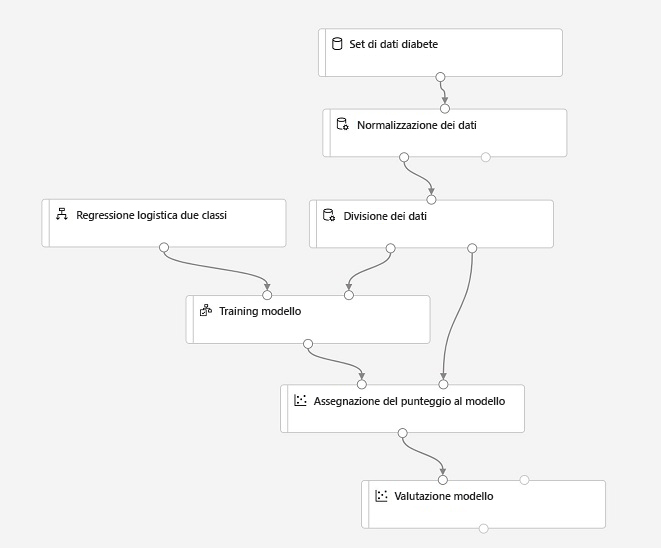
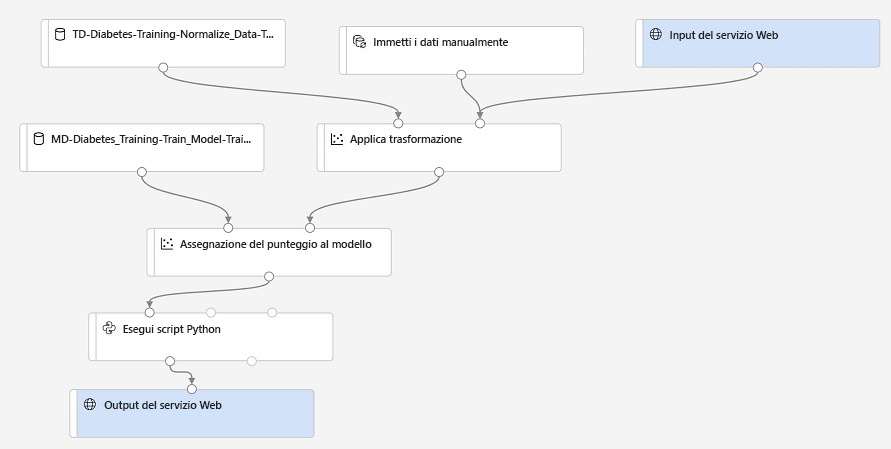

---
lab:
  title: Usare la finestra di progettazione di Azure Machine Learning
ms.openlocfilehash: 55911fdc4ea7e3a2b48ab0d0a583a0a24121ffca
ms.sourcegitcommit: d2354e40eec31c22eb09381c6a890311cccc30c9
ms.translationtype: HT
ms.contentlocale: it-IT
ms.lasthandoff: 06/11/2022
ms.locfileid: "146266849"
---
# <a name="use-azure-machine-learning-designer"></a>Usare la finestra di progettazione di Azure Machine Learning

La *finestra di progettazione* di Azure Machine Learning offre un ambiente di trascinamento della selezione in cui è possibile definire un flusso di lavoro o una *pipeline* di moduli di inserimento dati, trasformazione e componenti di training del modello per creare un modello di Machine Learning. È quindi possibile pubblicare la pipeline come servizio Web che le applicazioni client possono usare per eseguire servizi di *inferenza* (generazione di stime da nuovi dati).

## <a name="before-you-start"></a>Prima di iniziare

Se non è già stato fatto, completare l'esercizio *[Creare un'area di lavoro Azure Machine Learning](01-create-a-workspace.md)* per creare un'area di lavoro di Azure Machine Learning e un'istanza di calcolo e clonare i notebook necessari per questo esercizio.

## <a name="configure-compute-resources"></a>Configurare le risorse di calcolo

Per usare la finestra di progettazione di Azure Machine Learning, è necessario un ambiente di calcolo in cui eseguire l'esperimento di training del modello.

1. Accedere ad [Azure Machine Learning Studio](https://ml.azure.com?azure-portal=true) con le credenziali Microsoft associate alla sottoscrizione di Azure e selezionare l'area di lavoro Azure Machine Learning.
2. In Azure Machine Learning Studio visualizzare la pagina **Calcolo** e nella scheda **Istanze di ambiente di calcolo** avviare l'istanza di calcolo se non è già in esecuzione. Questa istanza di calcolo verrà usata per testare il modello sottoposto a training.
3. Durante l'avvio dell'istanza di calcolo, passare alla scheda **Cluster di elaborazione**. Se non si dispone già di un cluster di elaborazione, aggiungerne uno nuovo con le impostazioni seguenti. Il cluster verrà usato per eseguire la pipeline di training.
    - **Area**: *la stessa area dell'area di lavoro*
    - **Priorità macchina virtuale**: Dedicata
    - **Tipo di macchina virtuale**: CPU
    - **Dimensioni macchina virtuale**: Standard_DS11_v2
    - **Nome dell'ambiente di calcolo**: *immettere un nome univoco*
    - **Numero minimo di nodi**: 0
    - **Numero massimo di nodi**: 2
    - **Secondi di inattività prima della riduzione delle prestazioni**: 120
    - **Abilita accesso SSH**: opzione non selezionata

## <a name="review-the-training-dataset"></a>Verificare il set di dati di training

Ora che si hanno a disposizione alcune risorse di calcolo da poter usare per eseguire una pipeline di training, è necessario acquisire alcuni dati per eseguire il training del modello.

1. In Azure Machine Learning Studio visualizzare la pagina **Set di dati**. I set di dati rappresentano tabelle o file di dati specifici che si prevede di usare in Azure ML.
2. Se in precedenza è stato creato il **set di dati sul diabete**, aprirlo. In caso contrario, creare un nuovo set di dati da file Web, usando le impostazioni seguenti, e aprirlo:
    * **Informazioni di base**:
        * **Web URL** (URL Web): https://aka.ms/diabetes-data
        * **Nome**: set di dati diabete
        * **Dataset type** (Tipo di set di dati): tabulare
        * **Descrizione**: dati sul diabete
    * **Settings and preview** (Impostazioni e anteprima):
        * **Formato di file**: delimitato
        * **Delimitatore**: virgola
        * **Codifica**: UTF-8
        * **Intestazioni colonna**: Usa intestazioni del primo file
        * **Ignora righe**: Nessuno
    * **Schema**:
        * Includi tutte le colonne diverse da **Path**
        * Rivedi i tipi rilevati automaticamente
    * **Conferma i dettagli**:
        * Non profilare il set di dati dopo la creazione

4. Visualizzare la pagina **Esplora** per vedere un esempio dei dati. Questi dati rappresentano i dettagli dei pazienti sottoposti al test del diabete e verranno usati per eseguire il training di un modello in grado di prevedere la probabilità che un paziente risulti positivo al test sulla base di misurazioni cliniche.

## <a name="create-a-designer-pipeline"></a>Creare una pipeline della finestra di progettazione

Per iniziare a usare la finestra di progettazione, è prima di tutto necessario creare una pipeline e aggiungere il set di dati che si vuole usare.

1. In Azure Machine Learning Studio, visualizzare la pagina della **finestra di progettazione** e creare una nuova pipeline.
2. Modificare il nome della pipeline predefinito (**Pipeline-Created-on-* date***) in **Visual Diabetes Training** facendo clic sull'icona **&#9881;** a destra per aprire il riquadro **Impostazioni**.
3. Tenere presente che è necessario specificare una destinazione di calcolo in cui eseguire la pipeline. Nel riquadro **Impostazioni** fare clic su **Seleziona destinazione di calcolo** e selezionare il cluster di elaborazione desiderato.
4. Sul lato sinistro della finestra di progettazione selezionare la scheda **Dati** e trascinare il **set di dati diabete** nell'area di disegno.
5. Selezionare il componente del **set di dati diabete** nell'area di disegno. Farvi quindi clic con il pulsante destro del mouse e scegliere **Anteprima dei dati**.
6. Nel riquadro DatasetOutput selezionare la scheda **Profilo**.
7. Esaminare lo schema dei dati tenendo presente che è possibile visualizzare le distribuzioni delle varie colonne sotto forma di istogrammi. Chiudere quindi la finestra di visualizzazione.

## <a name="add-transformations"></a>Aggiungi trasformazioni

Prima di poter eseguire il training di un modello, è necessario in genere applicare alcune trasformazioni di pre-elaborazione ai dati.

1. Nel riquadro a sinistra selezionare la scheda **Componente** in cui è disponibile un'ampia gamma di componenti utili per trasformare i dati prima del training del modello. È possibile cercare i componenti nella parte superiore del riquadro.
2. Cercare il componente **Normalize Data** (Normalizza dati) e trascinarlo nell'area di disegno sotto il componente del **set di dati diabete**. Collegare quindi l'output del componente del **set di dati diabete** all'input del componente **Normalize Data** (Normalizza dati).
3. Selezionare il componente **Normalize Data** (Normalizza dati) e visualizzarne impostazioni: si noti che è necessario specificare il metodo di trasformazione e le colonne da trasformare. Lasciando quindi la trasformazione **ZScore**, modificare le colonne in modo da includere i nomi di colonna seguenti:
    * PlasmaGlucose
    * DiastolicBloodPressure
    * TricepsThickness
    * SerumInsulin
    * BMI
    * DiabetesPedigree

    **Nota**: viene eseguita la normalizzazione delle colonne numeriche posizionandole sulla stessa scala, in modo da evitare colonne con valori di grandi dimensioni che dominino il training del modello. In genere, si applica un intero insieme di trasformazioni di pre-elaborazione come questo per preparare i dati per il training, ma in questo esercizio opteremo per una procedura semplificata.

4. A questo punto, è possibile suddividere i dati in set di dati separati per il training e la convalida. Nel riquadro a sinistra cercare il componente **Split Data** (Suddividi dati) e trascinarlo nell'area di disegno sotto il componente **Normalize Data** (Normalizza dati). Collegare quindi l'output (a sinistra) del *set di dati trasformato* del componente **Normalize Data** (Normalizza dati) all'input del componente **Split Data** (Suddividi dati).
5. Selezionare il componente **Split Data** (Suddividi dati) e configurarne le impostazioni nel modo seguente:
    * **Splitting mode** (Modalità di suddivisione): Split Rows
    * **Fraction of rows in the first output dataset** (Frazione di righe nel primo set di dati di output): 0,7
    * **Random seed** (Valore di inizializzazione casuale): 123
    * **Stratified split** (Divisione stratificata): Falso

## <a name="add-model-training-components"></a>Aggiungere i componenti di training del modello

Con i dati preparati e suddivisi in set di dati di training e convalida, è ora possibile configurare la pipeline per il training e la valutazione di un modello.

1. Cercare il componente **Train Model** (Training modello) e trascinarlo nell'area di disegno sotto il componente **Split Data** (Suddividi dati). Collegare quindi l'output (a sinistra) del *primo set di dati di risultato* del componente **Split Data** (Suddividi dati) all'input (a destra) del *set di dati* del componente **Train Model** (Training modello).
2. Il modello di cui si sta eseguendo il training prevede il valore **Diabetico**: selezionare quindi il componente **Train Model** (Training modello) e modificarne le impostazioni in modo da impostare la **colonna etichetta** su **Diabetico** (rispettare esattamente l'ortografia e i caratteri maiuscoli/minuscoli)
3. L'etichetta **Diabetes** che verrà stimata dal modello è una colonna binaria (1 per i pazienti che diabetici, 0 per i pazienti che non hanno il diabete); è quindi necessario eseguire il training del modello usando un algoritmo di *classificazione*. Cercare il componente **Two-Class Logistic Regression** (Regressione logistica a due classi) e trascinarlo nell'area di disegno, a sinistra del componente **Split Data** (Suddividi dati) e sopra il componente **Train Model** (Training modello). Connetterne quindi l'output all'input (a sinistra) del **modello non sottoposto a training** del componente **Train Model** (Training modello).
4. Il test del modello con training si esegue usando il modello per assegnare un punteggio al set di dati di convalida separato durante la divisione dei dati originali. Cercare il componente **Score Model** (Punteggio modello) e trascinarlo nell'area di disegno, sotto il componente **Train Model** (Training modello). Collegare quindi l'output del componente **Train Model** (Training modello) all'input (a sinistra) del **modello con training** del componente **Score Model** (Punteggio modello) e trascinare l'output (a destra) del **secondo set di dati di risultato**  del componente **Split Data** (Suddividi dati) nell'input (a destra) del **set di dati** del componente **Score Model** (Punteggio modello).
5. Per valutare le prestazioni del modello, è necessario prendere in esame alcune metriche generate durante l'attribuzione dei punteggi al set di dati di convalida. Cercare il componente **Evaluate Model** (Valutazione modello) e trascinarlo nell'area di disegno, sotto il componente **Score Model** (Punteggio modello) e connettere l'output del componente **Score Model** (Punteggio modello) all'input (a sinistra) del **set di dati di punteggio** del componente **Evaluate Model** (Valutazione modello).

## <a name="run-the-training-pipeline"></a>Eseguire la pipeline di training

Dopo aver definito i passaggi del flusso di dati, è possibile ora eseguire la pipeline di training e procedere al training del modello.

1. Verificare che la pipeline sia simile alla seguente:

    

2. In alto a destra fare clic su **Invia**. Quando richiesto, creare quindi un nuovo esperimento denominato **mslearn-designer-train-diabetes** ed eseguirlo.  Verrà inizializzato il cluster di elaborazione e verrà quindi eseguita la pipeline, processo che potrebbe richiedere più di 10 minuti. È possibile visualizzare lo stato dell'esecuzione della pipeline in alto a destra, sopra l'area di progettazione.

    > **Suggerimento**: se si verifica l'errore **GraphDatasetNotFound**, selezionare il set di dati, nel riquadro Proprietà modificarne la **Versione** (è possibile passare da "Usa sempre la versione più recente" a "1" e viceversa) e quindi eseguire nuovamente la pipeline.
    >
    > Mentre sono in esecuzione, è possibile visualizzare sia la pipeline che l'esperimento creati nelle pagine **Pipeline** ed **Esperimenti**. Al termine, tornare alla pipeline **Visual Diabetes Training** nella pagina della **finestra di progettazione**.

3. Dopo il completamento del componente **Normalize Data** (Normalizza dati), selezionarlo e nel riquadro **Impostazioni** nella scheda **Outputs + logs** (Output e log) in **Data outputs** (Output dati) nella sezione **Transformed dataset** (Set di dati trasformato) fare clic sull'icona **Anteprima dei dati** e notare come sia possibile visualizzare le statistiche e le visualizzazioni di distribuzione per le colonne trasformate.
4. Chiudere le visualizzazioni **Normalize Data** (Normalizza dati) e attendere il completamento degli altri componenti. Visualizzare quindi l'output del componente **Evaluate Model** (Valutazione modello) per visualizzare le metriche delle prestazioni per il modello.

    **Nota**: le prestazioni di questo modello non sono molto elevate, soprattutto perché è stata eseguita solo una parte delle funzionalità di progettazione e di pre-elaborazione. È possibile provare altri algoritmi di classificazione e confrontare i risultati (connettere gli output del componente **Split Data** (Suddividi dati) a più componenti **Train Model** (Training modello) e **Score Model** (Punteggio modello) e connettere un secondo modello con punteggio al componente **Evaluate Model** (Valutazione modello) per visualizzare un confronto affiancato). L'obiettivo dell'esercizio è semplicemente quello di illustrare l'interfaccia della finestra di progettazione e non di eseguire il training di un modello perfetto.

## <a name="create-an-inference-pipeline"></a>Creare una pipeline di inferenza

Dopo aver usato una pipeline di *training* per eseguire il training di un modello, è ora possibile creare una *pipeline di inferenza* che usi il modello sottoposto a training per stimare le etichette per i nuovi dati.

1. Nell'elenco a discesa **Create inference pipeline** fare clic su **Real-time inference pipeline**. Dopo alcuni secondi, verrà aperta una nuova versione della pipeline denominata **Visual Diabetes Training-real time inference**.
2. Assegnare alla nuova pipeline il nome **Predict Diabetes** e riesaminarla. Poiché nella pipeline sono stati incapsulate le procedure di trasformazione della normalizzazione e di training del modello, si useranno le statistiche dei dati di training per la normalizzazione di tutti i nuovi valori dei dati e il modello sottoposto a training per l'assegnazione del punteggio ai nuovi dati.
3. Tenere presente che la pipeline di inferenza presuppone che i nuovi dati corrispondano allo schema dei dati di training originali e, pertanto, conterrà il **set di dati diabete** della pipeline di training. I dati di input, tuttavia, includono l'etichetta **Diabetic** stimata dal modello, da cui non è semplice intuire che include i dati di nuovi pazienti per i quali non è ancora stata eseguita una stima sul diabete.
4. Eliminare il **set di dati diabete** dalla pipeline di inferenza e sostituirlo con un componente **Enter Data Manually** (Immetti dati manualmente) connettendolo all'input dello stesso **set di dati** del componente **Apply Transformation** (Applica trasformazione) come **input del servizio Web**. Modificare quindi le impostazioni del componente **Enter Data Manually** (Immetti dati manualmente) in modo da usare l'input CSV seguente, che contiene i valori delle funzionalità senza etichette per altre tre nuove osservazioni di pazienti:

```CSV
PatientID,Pregnancies,PlasmaGlucose,DiastolicBloodPressure,TricepsThickness,SerumInsulin,BMI,DiabetesPedigree,Age
1882185,9,104,51,7,24,27.36983156,1.350472047,43
1662484,6,73,61,35,24,18.74367404,1.074147566,75
1228510,4,115,50,29,243,34.69215364,0.741159926,59
```

5. La pipeline di inferenza includerà il componente **Evaluate Model** (Valutazione modello). Poiché questo componente non è utile per eseguire stime a partire da nuovi dati, è necessario eliminarlo.
6. L'output del componente **Score Model** (Punteggio modello) includerà tutte le funzionalità di input e l'etichetta stimata e il punteggio di probabilità. Per limitare l'output solo alla stima e alla probabilità, eliminare il collegamento tra il componente **Score Model** (Punteggio modello) e l'**output del servizio Web** e aggiungere un componente **Execute Python Script** (Esegui script Python). Collegare l'output del componente **Score Model** (Punteggio modello) all'input (a sinistra) del **primo set di dati** del componente **Execute Python Script** (Esegui script Python) e collegare l'output del componente **Execute Python Script** (Esegui script Python) all'**output del servizio Web**. Modificare quindi le impostazioni del componente **Execute Python Script** (Esegui script Python) in modo da usare il codice seguente (sostituendo tutto il codice esistente):

```Python
import pandas as pd

def azureml_main(dataframe1 = None, dataframe2 = None):

    scored_results = dataframe1[['PatientID', 'Scored Labels', 'Scored Probabilities']]
    scored_results.rename(columns={'Scored Labels':'DiabetesPrediction',
                                    'Scored Probabilities':'Probability'},
                            inplace=True)
    return scored_results
```
> **Nota**: dopo aver incollato il codice nel componente **Execute Python Script** (Esegui script Python), verificare che il codice risultante sia simile al codice riportato sopra. I rientri sono importanti in Python e il componente avrà esito negativo se i rientri non vengono copiati correttamente. 

7. Verificare che la pipeline sia simile alla seguente:

    

9. Eseguire la pipeline come nuovo esperimento denominato **mslearn-designer-predict-diabetes** nel cluster di elaborazione usato per il training. Questo processo potrebbe richiedere tempo.

## <a name="deploy-the-inference-pipeline-as-a-web-service"></a>Distribuire la pipeline di inferenza come servizio Web

È ora disponibile una pipeline di inferenza per l'inferenza in tempo reale, che è possibile distribuire come servizio Web per poter essere usata dalle applicazioni client.

> **Nota**: In questo esercizio si distribuirà il servizio Web in un'istanza di Azure Container (ACI). Questo tipo di risorsa di calcolo viene creato dinamicamente ed è utile per le attività di sviluppo e test. Per un ambiente di produzione, è necessario creare un *cluster di inferenza*, che fornisce un cluster del servizio Azure Kubernetes che offre scalabilità e sicurezza migliori.

1. Se l'esecuzione della pipeline di inferenza **Predict Diabetes** non è ancora terminata, attenderne il completamento. Visualizzare quindi l'output del **set di dati di risultato** del componente **Execute Python Script** (Esegui script Python) per esaminare le etichette stimate e le probabilità relative alle tre osservazioni di pazienti nei dati di input.
2. In alto a destra fare clic su **Distribuisci** e distribuire un nuovo endpoint in tempo reale usando le impostazioni seguenti:
    -  **Nome**: designer-predict-diabetes
    -  **Descrizione**: prevedere il diabete.
    - **Tipo di ambiente di calcolo**: Istanza di Azure Container
3. Attendere il completamento della distribuzione del servizio Web tenendo presente che potrebbero essere necessari alcuni minuti. Lo stato della distribuzione viene visualizzato in alto a sinistra nell'interfaccia di progettazione.

## <a name="test-the-web-service"></a>Testare il servizio Web

È ora possibile eseguire il test del servizio distribuito da un'applicazione client; in questo caso si userà un notebook.

1. Nella pagina **Endpoint** aprire l'endpoint in tempo reale **designer-predict-diabetes**.
2. All'apertura dell'endpoint **designer-predict-diabetes**, nella scheda **Utilizzo** prendere nota dei valori **Endpoint REST** e **Chiave primaria**.
3. Tenendo aperta nel browser la pagina **Utilizzo** relativa alla pagina del servizio **designer-predict-diabetes**, aprire una nuova scheda nel browser e una seconda istanza di Azure Machine Learning Studio. Nella nuova scheda aprire la pagina **Notebook**.
4. Nella pagina **Notebook**, in **File personali**, passare alla cartella **/users/*nome-utente*/mslearn-dp100** in cui è stato clonato il repository del notebook e aprire il notebook **Get Designer Prediction**.
5. All'apertura del notebook, verificare che nella casella **Calcolo** sia selezionata l'istanza di ambiente di calcolo generata in precedenza e che tale istanza sia nello stato **In esecuzione**.
6. Nel notebook sostituire i segnaposto **ENDPOINT** e **PRIMARY_KEY** con i valori relativi al proprio servizio, che è possibile copiare dalla scheda **Utilizzo** nella pagina relativa all'endpoint.
7. Eseguire la cella di codice e visualizzare l'output restituito dal servizio Web.

## <a name="clean-up"></a>Eliminazione

Il servizio Web creato è ospitato in un'*Istanza di contenitore di Azure*. Se non si vogliono eseguire altri esperimenti con tale servizio, è consigliabile eliminare l'endpoint per evitare di accumulare tempi di utilizzo superflui per Azure. È anche opportuno arrestare l'istanza di ambiente di calcolo fino a quando non sarà nuovamente necessaria.

1. In Azure Machine Learning Studio, nella scheda **Endpoint**, selezionare l'endpoint **designer-predict-diabetes**. Fare quindi clic sul pulsante **Elimina** (&#128465;) e confermare l'eliminazione dell'endpoint.
2. Se per il momento non è più necessario usare Azure Machine Learning, nella scheda **Istanze di ambiente di calcolo** selezionare l'istanza di ambiente di calcolo desiderata e fare clic su **Arresta** per arrestarla.

> **Nota**: l'arresto delle risorse di calcolo garantisce che alla sottoscrizione non vengano addebitati i costi di calcolo corrispondenti. Verrà tuttavia addebitato un importo ridotto per l'archiviazione dei dati, fintanto che l'area di lavoro di Azure Machine Learning è presente nella sottoscrizione. Se è stata completata l'esplorazione di Azure Machine Learning, è possibile eliminare l'area di lavoro di Azure Machine Learning e le risorse associate. Tuttavia, se si prevede di completare altri lab di questa serie, è necessario prima ripetere l'esercizio *[Creare un'area di lavoro di Azure Machine Learning](01-create-a-workspace.md)* per creare l'area di lavoro e preparare l'ambiente.
